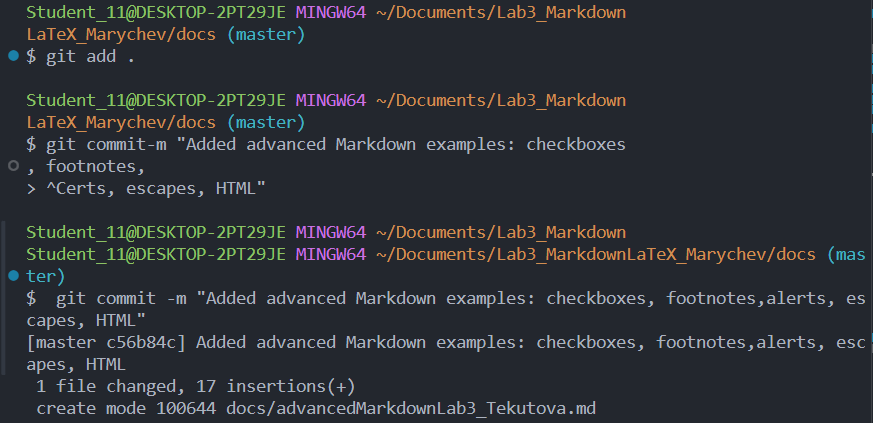

# Лабораторная работа №3
## Описание проекта:
 Работа с Markdown-разметкой и базовое
использование LaTeX в документации проекта

---

## Содержание проекта

[Заголовки и подзаголовки в Markdown](docs/headersLab3_Tekutova.md)

[Горизонтальные линии](docs/separatorsLab3_Tekutova.md)

[Текстовое форматирование](docs/formattingLab3_FIO.md)

[Списки в Markdown](docs/listsLab3_Tekutova.md)

[Ссылки и изображения в Markdown](docs/linksImagesLab3_FIO.md)

[Блоки кода и цитаты](docs/codeQuotesLab3_tekutova.md)

[Таблицы в Markdown](docs/tablesLab3_Tekutova.md)

[Дополнительные возможности Markdown](docs/advancedMarkdownLab3_Tekutova.md)

[LaTeX в Markdown](docs/latexLab3_Tekutova.md)


---

## Структура проекта
### Виды списков

**Маркированный список:**
- Первый элемент
- Второй элемент
- Третий элемент

**Нумерованный список:**
1. Первый пункт
2. Второй пункт
3. Третий пункт

**Вложенный список:**
- Основной пункт
  - Подпункт
  - Подпункт
    -  Подпункт

# Заголовок H1
## Заголовок Н2
### Заголовок Н3
---
**Форматирование текста**
- **полужирный**
- *курсив*
- ~~зачеркнутый~~
- моноширный
---
**Cписки:**
* маркированный
2. нумерованный
    - вложенный
----
**Цитата:**
> Это пример цитаты в Markdown..
---
**Блок кода**

### Пример блока кода на Python

```python
a=int(input())
b=int(input())
c=a+b
print(c)
```
---
**Таблица**

| № | ФИО студента | Оценка 
|--------|--------|-----------------|
| 1 |Иванов И.И. | 5 | 
| 2 | Петров П.П. | 4 | 
| 3 | Сидоров С.С. | 3 | 
| 4 | Текутова В.Д. | 5 |
---

**Изображение из папки img**


---

**Ссылка**
[Внешняя](https://m.vk.com/)
[Внутренняя](/docs/linksImagesLab3_FIO.md)

---

**Чекбоксы**
- [ ] Первая задача
- [x] Вторая задача

---
**Сноска**
Текст[^1]
[^1]: Примечание
---
**Alert-блоки GitHub**

>[!NOTE] 
Пример
>[!TIP]
Пример
>[!WARNING]
Пример

---
**Inline LaTeX**
Площадь круга: $S = \pi r^2$

---

**Block LaTeX**
$$
\sum_{i=1}^n i = \frac{n(n+1)}{2}
$$